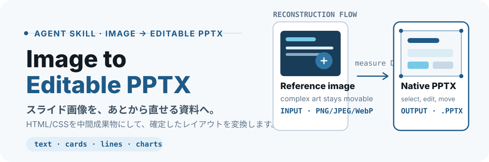

<p align="center">
  
</p>

スライド画像を参照してHTML/CSSへ再構築し、テキスト・基本図形・線・表・単純なグラフを編集できるPowerPoint（PPTX）として出力するAgent Skillです。

## できること

- 1画像を1スライドとして、入力順を保ったPPTXデッキへ変換
- タイトル、本文、数値、背景、カード、罫線を個別編集可能な要素として生成
- 写真・ロゴ・複雑なイラストは、移動・差し替え可能な個別画像として保持
- HTMLの文字切れと全面画像化を検出し、PPTX内部のテキスト・図形も検証
- LibreOfficeで再描画し、元画像との比較プレビューを生成

## 仕組み

`画像 → HTML/CSS → ブラウザが計算したDOM → ネイティブPPTX`

推測で画像を分解するのではなく、HTML/CSSでレイアウトを再構築してから、ブラウザが確定した座標・寸法・スタイルをPowerPointへ写します。画像全体を1枚貼り付ける方式ではありません。

このアプローチは、[FLUXのZenn記事](https://zenn.dev/flux/articles/5446dba24b5100)で紹介されたHTMLを中間成果物とする手法を参考にしています。変換には[`dom-to-pptx`](https://github.com/atharva9167j/dom-to-pptx)を使用します。

## 最短で試す

```bash
cd image-to-editable-pptx
npm install
npm test
```

CodexのユーザーSkillとして登録する場合は、Skillディレクトリをコピーまたはシンボリックリンクします。

```bash
ln -s "$(pwd)" ~/.codex/skills/image-to-editable-pptx
```

画像を添付後、次のように依頼します。

```text
$image-to-editable-pptx sample.pngを編集可能なPPTXへ変換して
```

## 手動変換

複雑なイラストを切り出し、再構築したHTMLを検証・変換・再描画比較します。

```bash
node scripts/extract-regions.mjs \
  --input reference.png \
  --regions work/regions.json \
  --output-dir work/assets

node scripts/validate-html.mjs \
  --input work/slides.html \
  --report work/html-validation.json

node scripts/export-pptx.mjs \
  --input work/slides.html \
  --output work/presentation.pptx

node scripts/verify-pptx.mjs \
  --input work/presentation.pptx \
  --expected-slides 1 \
  --report work/pptx-validation.json

node scripts/render-preview.mjs \
  --input work/presentation.pptx \
  --reference reference.png \
  --output-dir work/preview
```

`regions.json`は元画像のピクセル座標で、残す画像領域を指定します。

```json
{
  "regions": [
    {
      "id": "hero-illustration",
      "x": 300,
      "y": 160,
      "width": 860,
      "height": 900
    }
  ]
}
```

## 検証されること

- `.slide`要素、寸法、文字切れ、外部参照、全面画像化
- PPTXのZIP/XML構造、スライド数、ネイティブ図形、期待テキスト
- LibreOffice再描画と元画像の左右比較

テストは正常な領域切り出し、範囲外座標の拒否、HTML検査、PPTX実生成、編集可能なテキストと図形の保持を確認します。

```bash
npm run format:check
npm test
```

## 編集可能性と制約

- 編集可能：テキスト、背景、カード、線、基本図形、単純な表・グラフ
- 個別画像：写真、ロゴ、製品画面、複雑なイラスト、読み取れないグラフ領域
- 復元対象外：元画像にないテーマ、アニメーション、ノート、非表示データ

ブラウザとPowerPointではフォントメトリクスが異なるため、再描画比較は必須です。複雑なイラスト内の文字は、見た目を優先して画像内に残す場合があります。

## 必要環境

- Node.js 22以降とnpm
- Google ChromeまたはChromium（HTML/CSSのレイアウト計測用）

`npm install`は、`dom-to-pptx`、Sharp、JSZipなどのNode.js依存をインストールします。ブラウザと比較プレビュー用ツールはOS側で別途導入が必要です。

Ubuntu/Debianでは、次のパッケージを導入してください。

```bash
sudo apt install libreoffice poppler-utils
```

- `libreoffice`：生成したPPTXを再描画して見た目を比較する場合のみ必要
- `poppler-utils`：`pdftoppm`を提供し、比較用PDFをPNGへ変換する場合のみ必要
- ChromeまたはChromium：PPTX変換時のDOM計測に必須。ディストリビューションの提供方法に従って導入

比較プレビューを使わない場合、LibreOfficeと`poppler-utils`は不要です。

### WSLで利用する場合

WSL内のLinux環境で変換・検証を実行できます。Windows側ではなく、WSL内にNode.js、ChromeまたはChromium、必要に応じて比較プレビュー用ツールを導入してください。

```bash
sudo apt update
sudo apt install libreoffice poppler-utils
```

- ChromeまたはChromiumはWSL内のLinux版を使います。`/usr/bin/google-chrome`、`/usr/bin/chromium`、`/usr/bin/chromium-browser`のいずれかが利用可能である必要があります。
- 変換だけならChromeまたはChromiumのみが必須です。
- 比較プレビューも実行する場合は、上記に加えて`libreoffice`と`poppler-utils`が必要です。
- Windows側に導入したChrome、LibreOffice、Microsoft PowerPointはこのSkillでは使用しません。

## セキュリティ

- 受け付けるラスター画像はPNG、JPEG、WebPのみ
- リモートURL、data URL、絶対パスの画像は拒否
- 変換は独立プロセスで実行し、120秒で終了
- APIキーや外部AIサービスは不要

`dom-to-pptx`の推移依存`image-size`には、ICNS・JXL・HEIF入力に関する未修正のサービス拒否（DoS）アドバイザリがあります。本Skillは形式制限、Sharpによる正規化、外部参照拒否、プロセスタイムアウトで影響範囲を制限します。

## 構成

```text
image-to-editable-pptx/
├── SKILL.md                    Agent Skill本体
├── assets/slide-template.html 再構築用HTMLテンプレート
├── references/                変換・編集可能性・安全性の規則
├── scripts/                   切り出し・変換・検証ツール
└── test/                      自動テストとサンプル画像
```

## 謝辞

HTMLを中間成果物として編集可能なPowerPointへ変換する発想の共有にあたり、[FLUXのZenn記事](https://zenn.dev/flux/articles/5446dba24b5100)を公開してくださった皆さまに感謝します。

## ライセンス

[MIT License](./LICENSE)のもとで公開しています。
